# CLI
- `.` 현재 디렉토리   
- `..` 현재의 상위 디렉토리(부모 폴더)   
- `touch` 파일 생성    
- `mkdir x` 새 디렉토리 생성    
- `ls` 현재 작업 중인 디렉토리 내부의 폴더/파일 목록 출력   
- `cd` 현재 작업 중인 디렉토리 변경(위치 이동)   
- `start` 폴더/파일 열기(Mac에서는 open 사용)   
- `rm` 파일 삭제(디렉토리 삭제는 -r 옵션을 추가 사용)

# 절대 경로/상대 경로
## 절대 경로
- Root 디렉토리부터 목적 지점까지 거치는 모든 경로를 전부 작성한 것    
- 윈도우 바탕 화면의 절대 경로 예시 `C:/Users/ssafy/Desktop`
## 상대 경로
- 현재 작업하고 있는 디렉토리를 기준으로 계산된 상대적 위치를 작성한 것   
- 만약 현재 작업하고 있는 디렉토리가 `C:/Users`일 때 윈도우 바탕화면으로의 상대 경로는 `ssafy/Desktop`

# 버전 관리 시스템
## git
분산 버전 관리 시스템   
-> 코드의 '변경 이력'을 기록하고 '협업'을 원활하게 하는 도구
### 버전관리
변화를 기록하고 추적하는 것
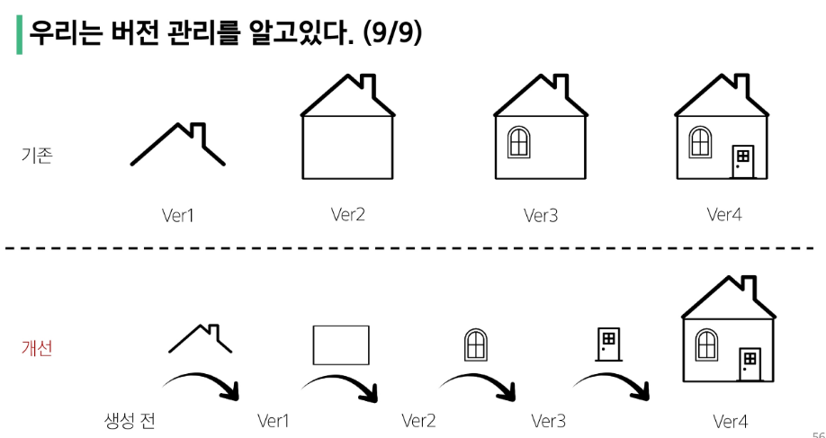
### 분산
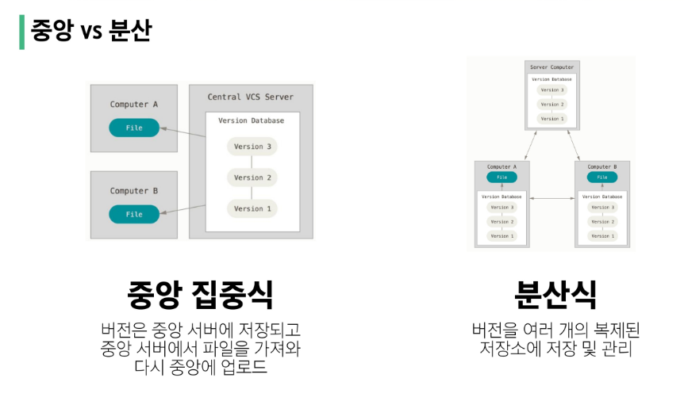 
<중앙 집중식의 문제점>  
-> 기존에는 중앙 집중식으로 보안 이슈로 하였지만, 회사 서버에 불이 나거나 같은 일이 생긴다면???    
-> A와 B가 같은 파일의 같은 줄을 수정하고 업데이트를 한다면 충돌이 나는 문제가 발생함

**분산 구조에서의 장점**
- 중앙 서버에 의존하지 않고도 동시에 다양한 작업을 수행할 수 있음
- 개발자들 간의 충돌을 줄여주고 개발 생산성 향상
- 중앙 서버의 장애나 손실에 대비하여 백업과 복구가 용이
- 인터넷에 연결되지 않은 환경에서도 작업을 계속할 수 있음
- 변경 이력과 코드를 로컬 저장소에 기록하고, 나중에 중앙 서버에 동기화

**git의 역할**
- 코드의 버전(히스토리)를 관리
- 개발되어 온 과정 파악
- 이전 버전과의 변경 사항 비교

## git의 영역
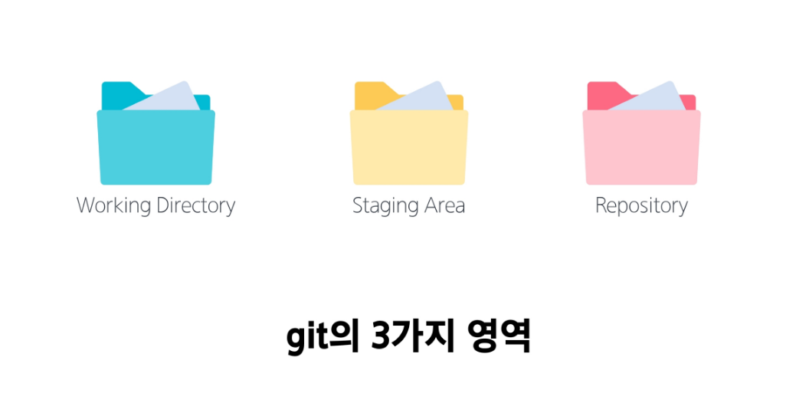
- **Working Directory**: 실제 작업 중인 파일들이 위치하는 영역   
- **Staging Area**: Working Directory에서 변경된 파일 중, 다음 버전에 포함시킬 파일들을 선택적으로 추가하거나 제외할 수 있는 중간 준비 영역
- **Repository**: 버전(commit) 이력과 파일들이 영구적으로 저장되는 영역, 모든 버전(commit)과 변경 이력이 기록됨

*Commit-*버전*
변경된 파일들을 저장하는 행위이며,   
마치 사진을 찍듯이 기록한다 하여 'snapshot'이라고도 함

## git의 동작
`git init`   
로컬 저장소 설정(초기화)   
-> git의 버전 관리를 시작할 디렉토리에서 진행   
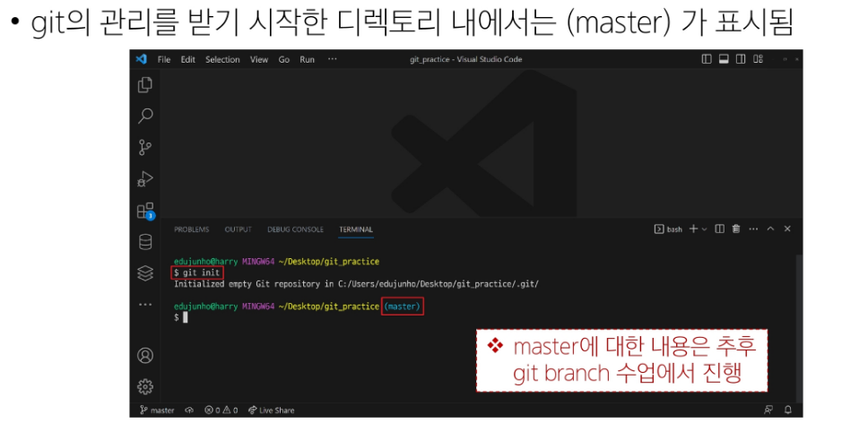   
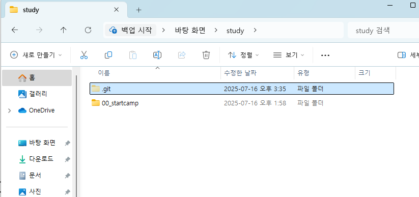   
git이 영역을 관리하기 위한 폴더

`git add`   
변경사항이 있는 파일을 staging area에 추가   
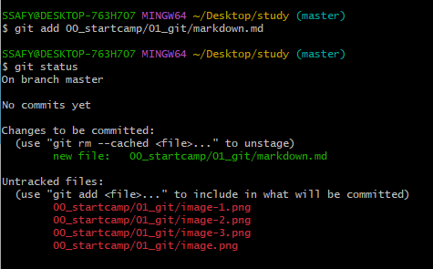   
*`git status`로 staging area 확인 가능

`git commit`   
staging area에 있는 파일들을 저장소에 기록      
-> 해당 시점의 버전을 생성하고 변경 이력을 남기는 것   
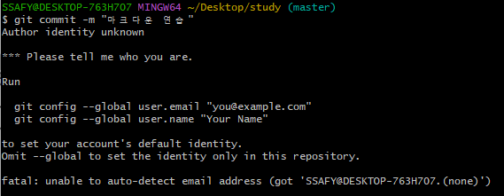   
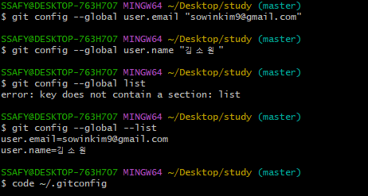      
수정하고 싶을 시 `code ~/.gitconfig`   
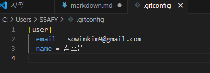     

`git status`   
현재 로컬 저장소의 파일 상태 보기   
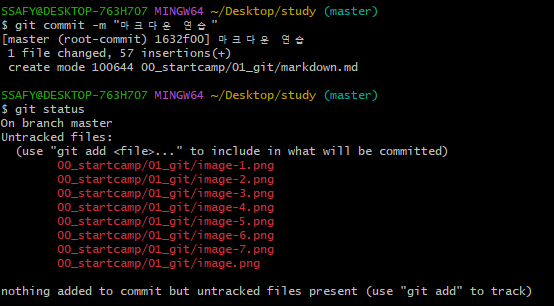     
-> 성공적으로 commit 후 track 파일 없어짐       

`git log`   
commit history 보기   
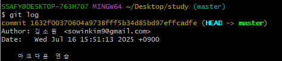       
`git log --oneline`  
commit 목록 한 줄로 보기   
`git config --global -l`   
git global 설정 정보 보기   

#### <git의 process>
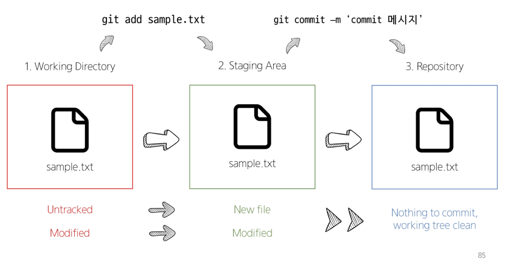      
git은 로컬 저장소 내 모든 파일의 '변경사항'을 감시하고 있다!

#### <git init 주의사항>
- git 로컬 저장소 내에 또다른 git 로컬 저장소를 만들지 말 것
- 즉, 이미 git 로컬 저장소인 디렉토리 내부 하단에서  git init 명령어를 다시 입력하지 말 것
- git 저장소 안에 git 저장소가 있을 경우 가장 바깥쪽의 git 저장소가 안쪽의 git 저장소의 변경사항을 추적할 수 없기 때문