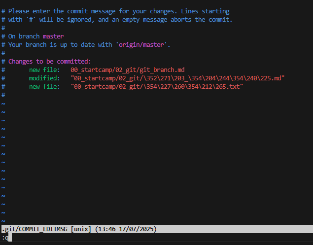

## 1.git config 초기화
+ `$ git config --global` 설정 삭제    
+ `$ code ~/.gitconfig`를 실행   
+ 해당 설정에 작성된 username과 email 모두 지우기
## 2.자격 증명 초기화
+ win + 자격 증명 검색 > 자격 증명 관리자
+ windows 자격 증명 > 깃허브, 깃랩 계정 정보 삭제

## 기타
### 다른 사람의 파일을 clone하고 수정하면???
-> 안 돼요!    
-> 나중에 branch에서 하도록 합시다.   
-> 그리고 push도 권한이 없어서 안 될 것 (나중에 팀이면 문제가 생길 수도??? 내 생각임)

### git commit
`git commit`에서 커밋메시지를 남기지 않고 실행하게 되면 vim을 만나게 됌. vim은 메모장이라고 생각하면 됌 -> `:q` 작성 후 엔터

