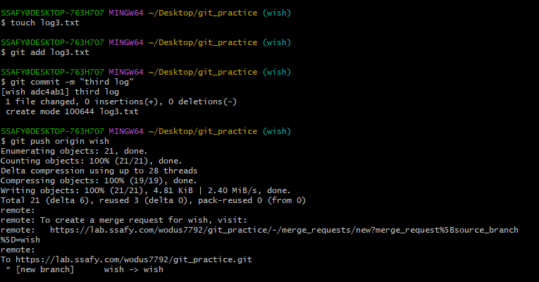

`git branch -c <branch name>`  
+ 브랜치 만들기

`git switch <branch name>`
+ 브랜치 바꾸기

### 예시
1. 팀원 A는 로그인 기능을 작업한다.
2. 팀원 B는 게시글 작성 기능을 작업한다.
3. 팀원 A와 B는 모드 setting.py의 내용을 필요로한다.

`git branch -c viktor/login`   
`git branch -c harry/article`   
`git branch`   
  
-> branch에 생성된 모습 

`git switch viktor/login` -> viktor/login 브랜치로 바뀜   
`touch login.py` -> viktor/login 브랜치에 login.py 파일 생성   
`git switch harry/article` -> harry/article 브랜치로 바뀜      
`touch article.py` -> harry/article 브랜치에 article.py 파일 생성    
`git merge viktor/login` -> viktor/login 파일 merge     
`git merge harry/article` -> harry/article 파일 merge           
   
    
-> master 브랜치에 추가됌   
Fast Forward Merge: 현재 브랜치의 commit을 대상 브랜치의 commit까지 옮기는 작업    

`git log --oneline --graph`   
  

`git branch -d viktor/login`   
`git branch -d harry/article`  
-> 브랜치들 삭제

  

### 과제
1. 각자 개인 브랜치에서 커밋을 최소 3개 이상 생성한다.
2. 원격 저장소에 push한다.
3. merge request를 생성한다.
4. master에 merge한다.
5. local에서 master에서 pull 받는다.
6. 개인 브랜치를 삭제한다.
    
    
